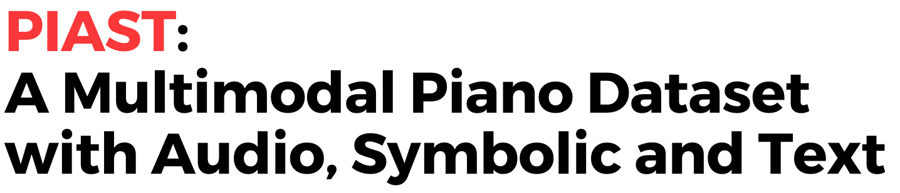

# PIAST: Multimodal Piano Dataset with Audio, Symbolic and Text

[](https://opensource.org/licenses/MIT)
[]() 
[](https://huggingface.co/datasets/Hayeonbang/PIAST)
[](https://hayeonbang.github.io/PIAST_dataset/)




This is the repository for the **PIAST dataset**, which contains a collection of piano performance audio, transcribed MIDI and corresponding text data. You can see the demo of the dataset on this [link](https://hayeonbang.github.io/PIAST_dataset/).


## Dataset
Our dataset has two subsets; **PIAST-YT** and **PIAST-AT** (details can be found in the [paper](https://arxiv.org/abs/2410.03264)). Both subsets contain audio, MIDI and text data. 
- **Audio**: We provide the list of the *YouTube IDs* and the corresponding codes for downloading
- **MIDI, Text**: Transcribed MIDI and the text data are available on the [Hugging Face](https://huggingface.co/datasets/Hayeonbang/PIAST)

## Download
```bash
pip install youtube-dl ffmpeg pydub
```

```python
python yt_main.py
python at_main.py
```

## Experiment
Code for the experiments in the paper will be updated soon! 

## License
This project is licensed under the MIT License - see the [LICENSE](LICENSE) file for details.

## Citation
Citation format will be updated soon

